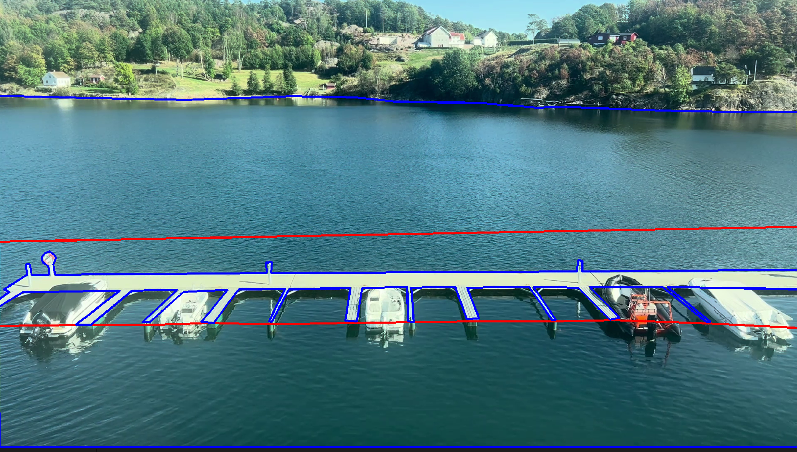
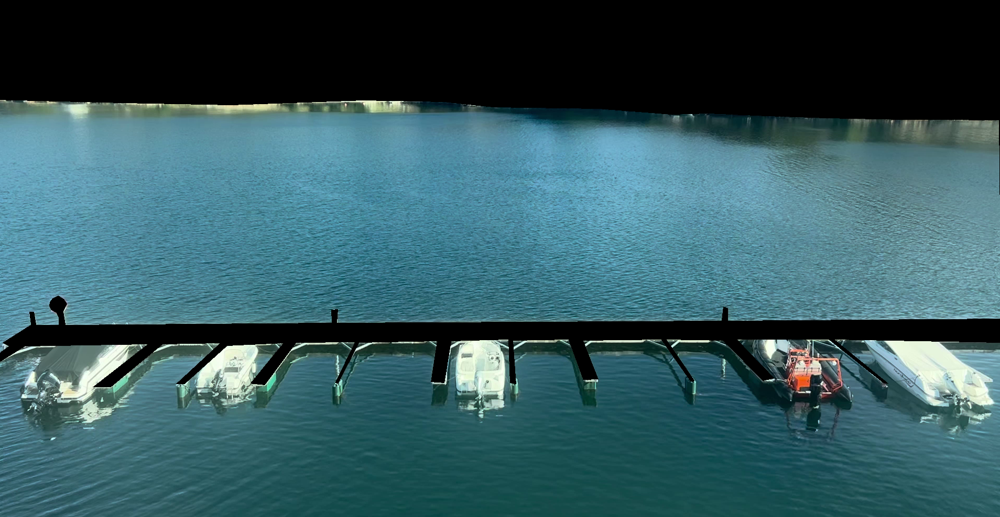
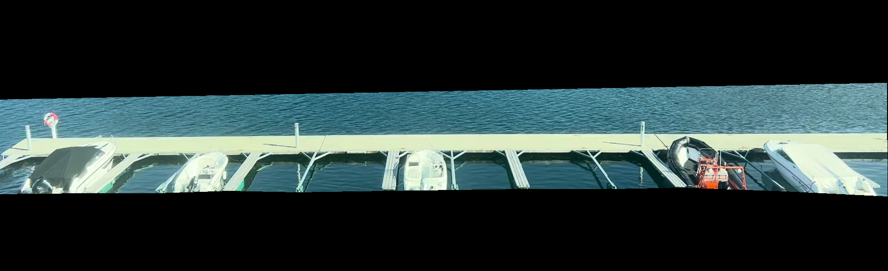

# Motion Detection 
*short explainatoin on how the motion detection is made*

## Motion detection 1.0

The first implementation was inspired by the approach presented by LearnOpenCV for moving object detection. The method started with  using OpenCV's MOG2 background subtractor to generate a foreground mask.

```
backSub = cv2.createBackgroundSubtractorMOG2(detectShadows = True, varThreshold=30)

fg_mask = backSub.apply(frame)
```

 Shadow pixels were removed through thresholding,  followed by morphological opening to reduce noise.
 
```
kernel = cv2.getStructuringElement(cv2.MORPH_ELLIPSE, (3, 3))

retval, mask_thresh = cv2.threshold(fg_mask, 150, 255, cv2.THRESH_BINARY) # cv2.threshold(fg_mask, replace all values under 180 to 0, 255, cv2.THRESH_BINARY )

mask_eroded = cv2.morphologyEx(mask_thresh, cv2.MORPH_OPEN, kernal)
``` 

Contours were then extracted, and objects with an area above a predefined threshold were identified as moving objects and enclosed by bounding boxes.

```
contours, hierarchy = cv2.findContours(mask_eroded, cv2.RETR_EXTERNAL, cv2.CHAIN_APPROX_SIMPLE)

min_contour_area = min_area # minimum area treshold
large_contours = [cnt for cnt in contours if cv2.contourArea(cnt) > min_contour_area]

frame_out = frame.copy()
for cnt in large_contours:
    x, y, w, h = cv2.boundingRect(cnt)
    frame_out = cv2.rectangle(frame, (x, y), (x+w, y+h), (0, 0, 200), 2)
```

This was a simple implementation that did the bear minimum for a motion detection. However the task is on a dock with waves in the bacground that moves. So it had a hard time not detect bacground. There for version 2.0 were designed. 


## Motion detection 2.0

To improve the motion detection wee needed something that chould ignore the movement in the waves without removing the possibility to se the persons on the dock. To do that we figured it maight be better to devide the fotage into **two sones** to have different tresholds. 

In our security survilence of the dock we chould say there is **two zones**. One for **the dock** and one for the **water**. 

To make these sones we use click it sones like Herator implemented in the beginning. In this zones we need to make one for the dock and where we "assume" that we can detect people. And a zone where we can assume we can detect boats. Since we know that boats should not be on the dock and not on land we make a zone that removes these areas. In the photo below you can see the two zones. 




Then we need to make the motion detection in the different zones we started with [polygonal masks](https://blog.finxter.com/5-best-ways-to-mask-an-image-in-opencv-python/) to remove sections we are not intrested too look for movement in. We make one for the person detection and one for the boat detection. 
To do this we needed an numpy array, and with the click zone location got stored as json. so startet with converting them to numpy array. 

This made us end up with: 


